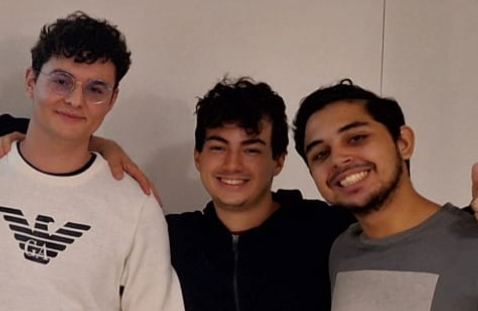
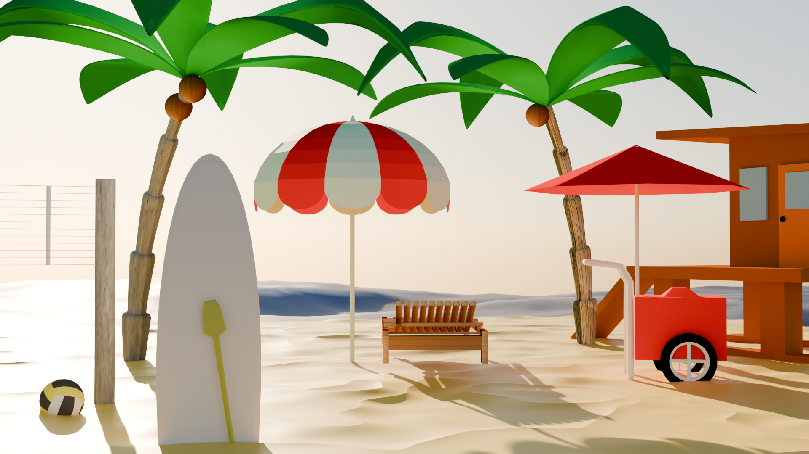
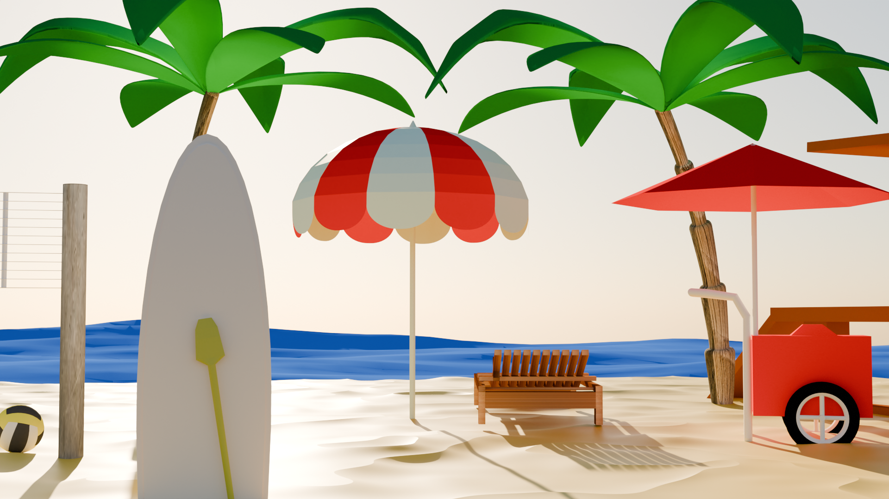
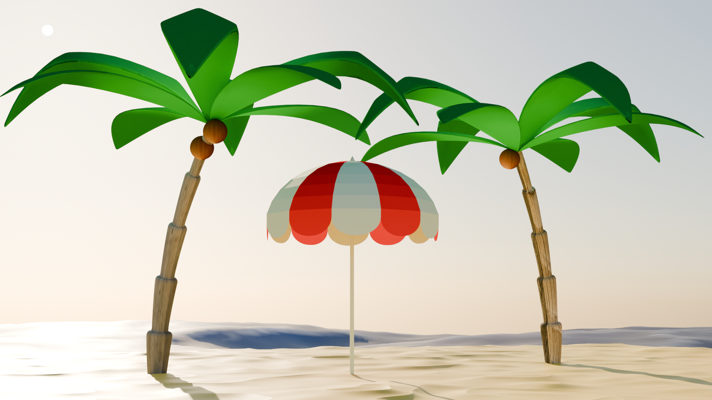
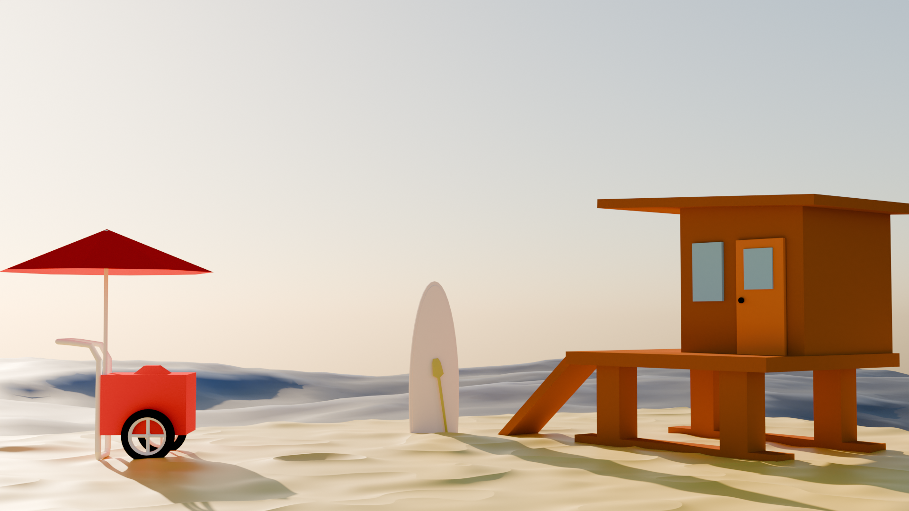
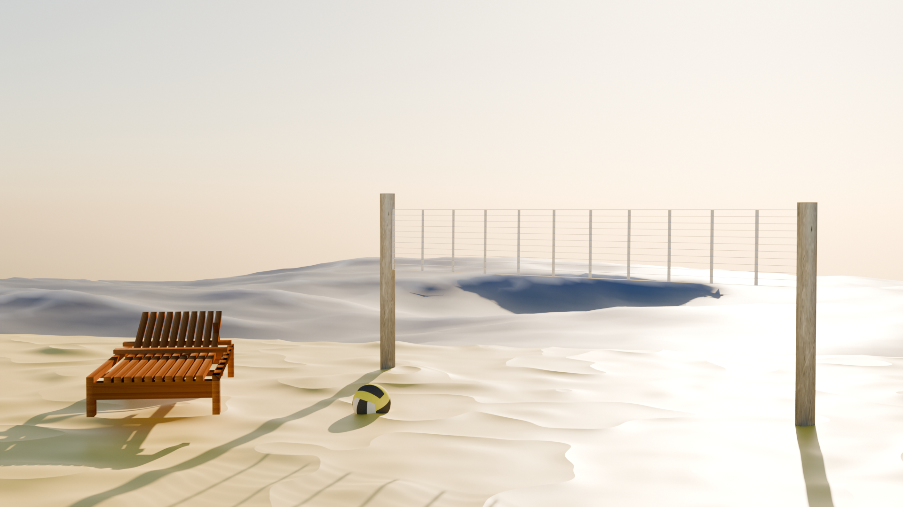

# Blender_Scenario

TEMA: **PRAIA**

Versão blender usada: 4.1

Integrantes do grupinho:

- Iuri Guimarães Pinheiro 

- Arthur Guaritá Brasil

- Arthur Cavalcante Neves

## Objetos:

> Guarda-sol (Arthur Guaritá)  :ok:

> Bola de volei (Arthur Guaritá) :ok:

> Coqueiro (Arthur Guaritá) :ok:

> Mar (Arthur Guaritá) :ok:

> Vôlei de praia (Arthur Cavalcante) :ok:

> Areia (Arthur Cavalcante) :ok:

> Cadeira de praia (Arthur Cavalcante) :ok:

> Carrinho de picolé (Iuri) :ok:

> Casa (Iuri) :ok:

> Prancha (Iuri) :ok:

Obs.: Criar os objetos em arquivos .obj separados para juntar todos no blender main

## Fotos

Obs.: deixei a areia e o oceano como base para as fotos de obj separadas

Fotos gerais

Foto dos objetos feitos Arthur Guaritá

Foto dos objetos feitos Iuri Guimarães

Foto dos objetos feitos Arthur Cavalcante

